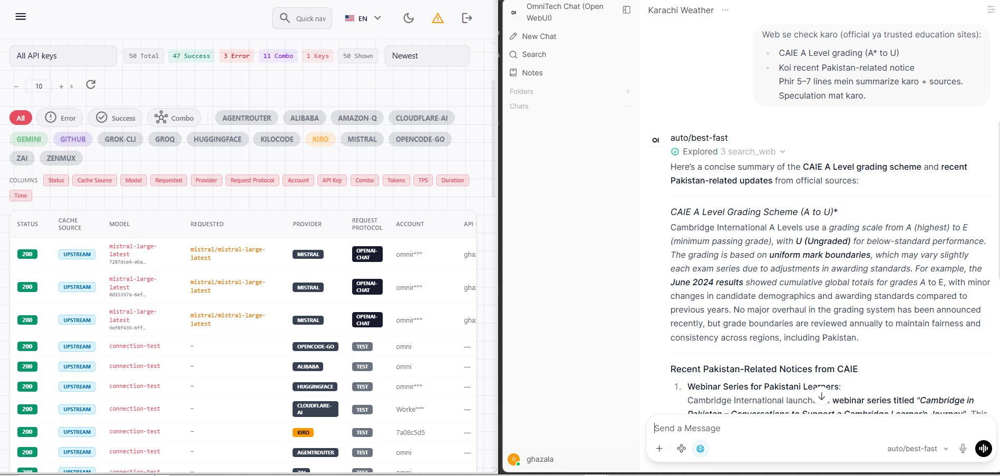
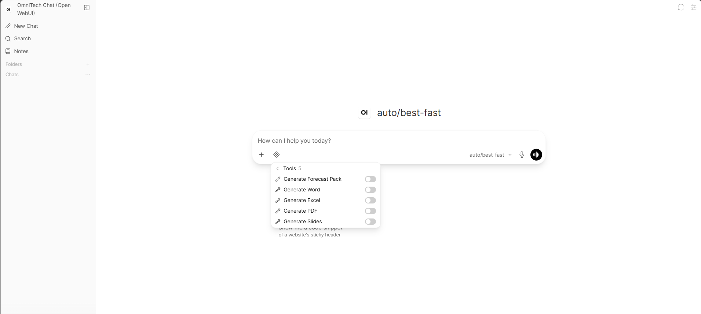
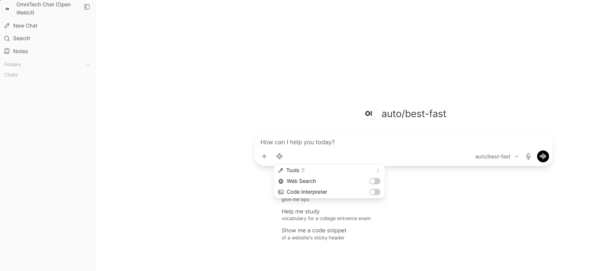
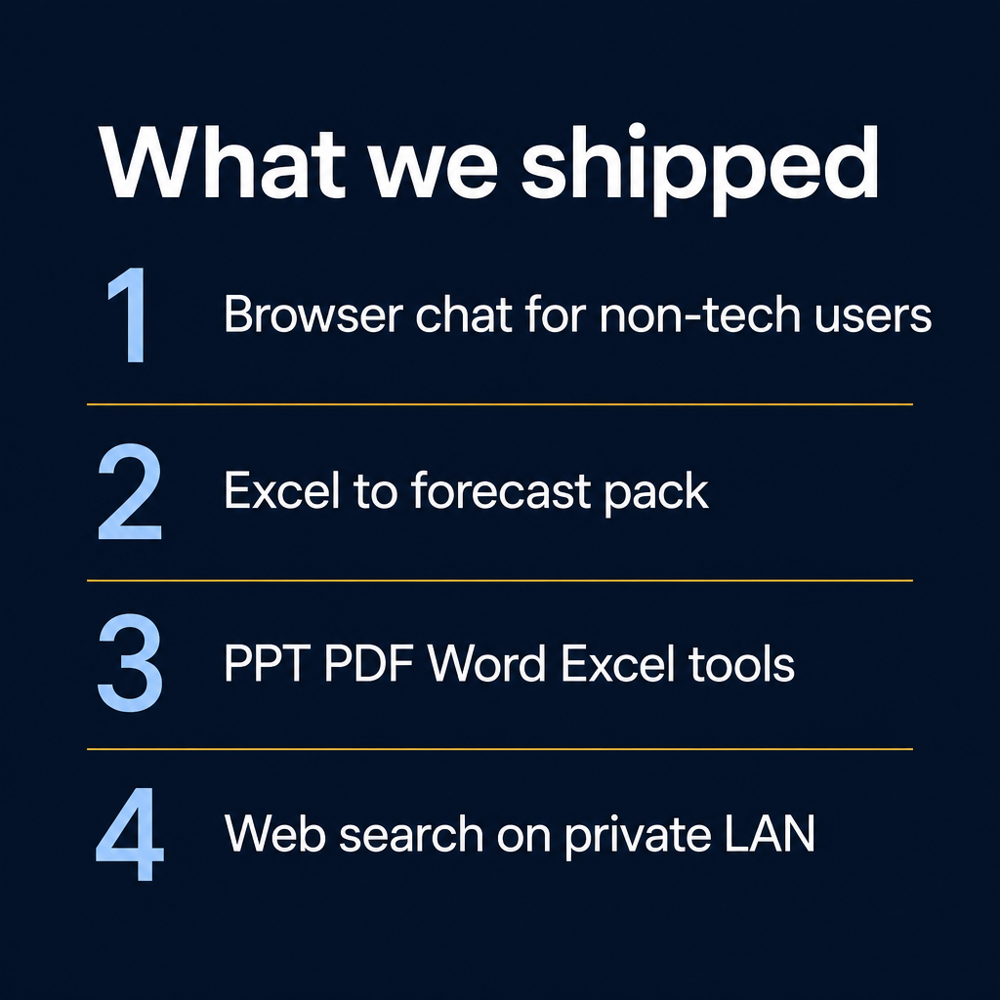

# OmniTech Chat — Open WebUI + OmniRoute

> **Production case study:** private LAN AI front door for non-technical users, with model routing, document tools, web search, and hard-won ops fixes.


**Stack:** [Open WebUI](https://github.com/open-webui/open-webui) (browser chat) → **OmniRoute** (OpenAI-compatible router) → upstream providers (`auto/best-*` profiles).

This repo documents how we run it **flawlessly on-prem**, what broke, how we fixed it, and where the same pattern applies beyond schools.

---

## Why we built it

Non-tech staff (first user: academic lead at a school) needed:

- Browser chat — **no VS Code / Continue**
- Excel in → analysis / forecast pack / PPT / PDF / Word / Excel out
- Optional **web search** with sources
- Data stays on the **LAN** (not a public SaaS chat)

Engineers keep the power path: **Continue → OmniRoute**.  
Everyone else gets **OmniTech Chat** (Open WebUI).



---

## Architecture (high level)

```
┌─────────────────────┐     OpenAI /v1      ┌─────────────────┐     providers
│  Open WebUI         │ ──────────────────► │  OmniRoute      │ ─────────────►
│  :3080  (LAN bind)  │   auto/best-*       │  :20128         │  Grok/Gemini/…
│  tools + web search │                     │  keys + logs    │
└─────────────────────┘                     └─────────────────┘
         │
         ├── Generate Slides / PDF / Word / Excel / Forecast Pack
         ├── Code Interpreter (optional Jupyter)
         └── DuckDuckGo web search (no API key)
```

| Layer | Role |
|---|---|
| **Open WebUI** | Non-tech front door, tools UI, files, permissions |
| **OmniRoute** | Single `/v1` endpoint, multi-provider routing, quotas, logs |
| **Custom tools** | Native Office outputs + CAIE-style forecast pack |
| **Filter** | File Job Follow-up — one clarification round before generate |

---

## What shipped (UI)



| Capability | Notes |
|---|---|
| **Generate Forecast Pack** | Multi-sheet Excel (Summary / AS / A2 / Variance + colours); **FULL_FILE_READ** via `job=forecast_from_source` |
| **Generate Slides / PDF / Word / Excel** | Native office files via OWUI Files API; attached sheets → `job=subject_group_report` (complete disk read) |
| **Web Search** | DuckDuckGo; toggle in Tools grid |
| **Code Interpreter** | Optional Jupyter sidecar |
| **Model profiles** | e.g. `auto/best-fast`, `auto/best-coding` via OmniRoute (harden providers to avoid combo burn) |





---

## Challenges we faced → how we fixed them

Full write-up: **[docs/CHALLENGES-AND-FIXES.md](docs/CHALLENGES-AND-FIXES.md)**

| Challenge | Fix |
|---|---|
| LibreChat model fetch timeouts / empty replies | Moved front door to **Open WebUI**; keep chip Follow-Up Auto-Generation **OFF** |
| File tools returning `sandbox:` URLs | Save via OWUI **Files API** → `/api/v1/files/{id}/content` |
| Custom tools invisible to non-admin user | `access_grant` **read** for tools (`user:*` + user id) |
| Web search missing | `ENABLE_WEB_SEARCH` + `WEB_SEARCH_ENGINE=duckduckgo` |
| Host dirty reboots (MCE / CMCI) | Remove mixed 4GB+16GB RAM; matched DIMMs; `mce_watch`; softdog watchdog |
| After reboot stack “forgot” wiring | Boot heal scripts / compose env that survives recreate |
| OmniConnect Redis clash | Never steal host Redis **6379** for other stacks |
| Subject-wise Excel incomplete (RAG invent) | **FULL_FILE_READ** — tools read complete `.xlsx`; `job=subject_group_report` / `forecast_from_source` |
| Same-chat “cooling down” / Maximum combo | Harden OmniRoute: keep only proven providers ON; `harden_bestfast_combo.py` |

---

## How we keep it flawless (ops checklist)

1. **LAN-only bind** for WebUI (no WAN expose without reverse proxy + auth harden).
2. **Secrets in `.env` mode 600** — never commit keys (see `.env.example`).
3. **Compose env** pins: web search ON, follow-up chips OFF, OmniRoute as `OPENAI_API_BASE_URL`.
4. **Tool ACL** after install: grant read to users who need Generate*.
5. **Deps inside OWUI image** after recreate: `python-pptx`, `pillow`, `reportlab`, `python-docx`, `openpyxl`, `ddgs`.
6. **Hardware watch:** `mce_watch` / rasdaemon; avoid mixed DIMM capacities.
7. **Feel-test path:** New Chat → Tools ON → Excel attach or web question → download via Files API.

Example compose: [`deploy/docker-compose.open-webui.example.yml`](deploy/docker-compose.open-webui.example.yml)

---

## Purpose & where else it fits (beyond school)

**Purpose:** give non-technical operators a **safe, on-prem chat + tools** surface on top of an existing model router — without handing them IDE workflows.

| Domain | Example jobs |
|---|---|
| **Education** | Forecast vs exam packs, parent summaries, research with sources |
| **Textile / manufacturing ops** | SOPs → PDF/Word, shift reports → Excel, policy Q&A + web check |
| **Finance / admin** | Recurring Excel packs, board one-pagers (PDF/PPT) |
| **IT / helpdesk** | Internal runbooks, ticket summaries, sanitized web lookups |
| **HR / compliance** | Policy drafts (DOCX), training decks (PPTX) |
| **Agencies / freelancers** | Client deliverable generation on a private box |

Same pattern everywhere: **one router (OmniRoute) + one friendly UI (Open WebUI) + domain tools**.

More: **[docs/USE-CASES.md](docs/USE-CASES.md)**

---

## Repo layout

```
assets/                 # screenshots + LinkedIn graphics
deploy/
  docker-compose.open-webui.example.yml
  .env.example
  tools/                # OWUI Python tools (Generate*)
  functions/            # File Job Follow-up filter
docs/
  CHALLENGES-AND-FIXES.md
  USE-CASES.md
  QUICKSTART.md
```

---

## Quick start

See **[docs/QUICKSTART.md](docs/QUICKSTART.md)**.

```bash
cp deploy/.env.example deploy/.env   # fill OmniRoute URL + key
cd deploy && docker compose -f docker-compose.open-webui.example.yml up -d
# Install tools from deploy/tools into OWUI Workspace → Tools
# Grant tool read access to non-admin users
```

---

## Security notes

- Do **not** publish API keys, Jupyter tokens, or real student spreadsheets.
- Prefer LAN bind or SSO/reverse proxy before internet exposure.
- Signup: disable after admin + named users exist.
- Screenshots in `assets/` are redacted/ops-safe; strip PII before adding more.

---

## Credits

- Open WebUI community  
- OmniRoute (OmniTech model gateway)  
- Built and battle-tested by **OmniTech** (`tagtuner`) — 2026

## License

MIT — see [LICENSE](LICENSE).
